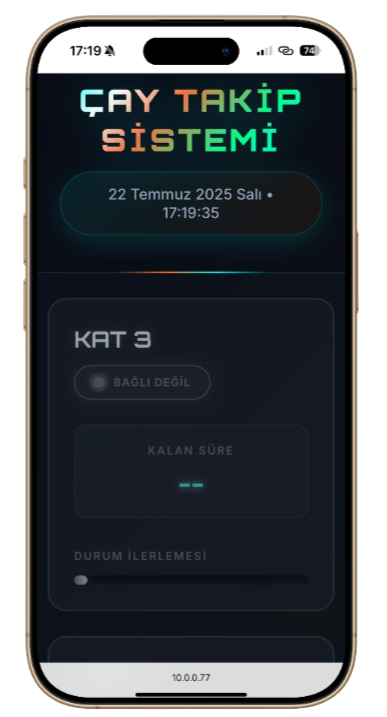
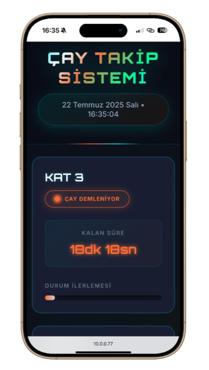
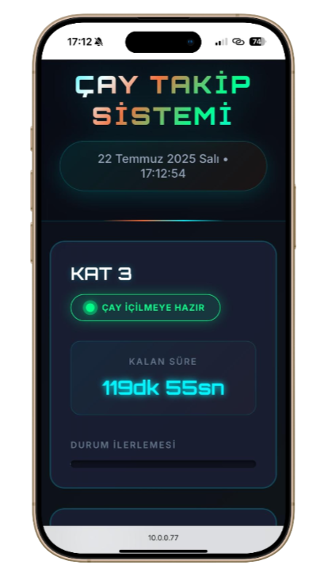
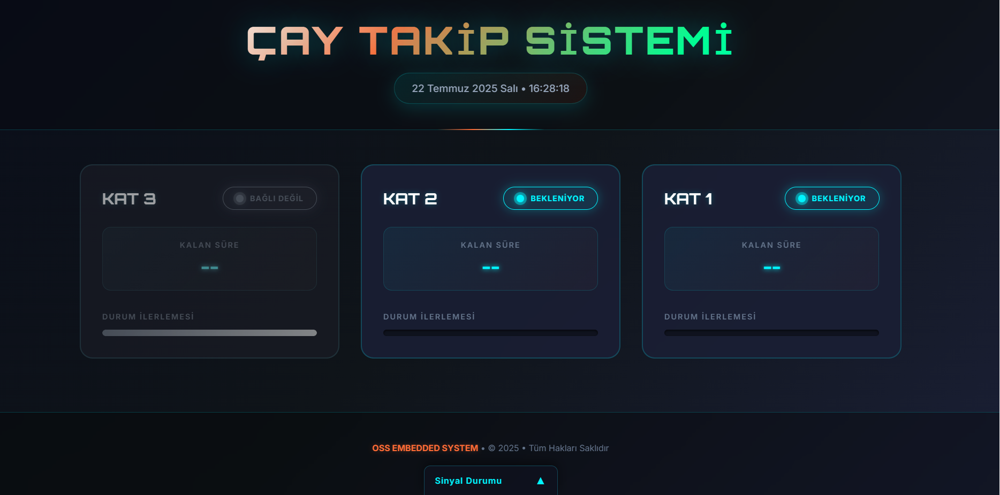
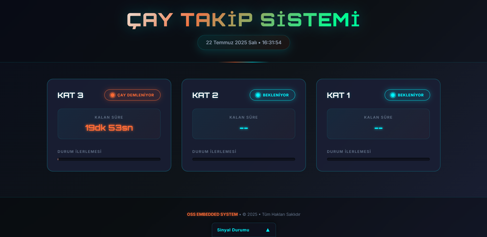
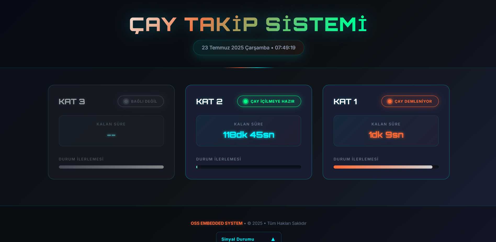
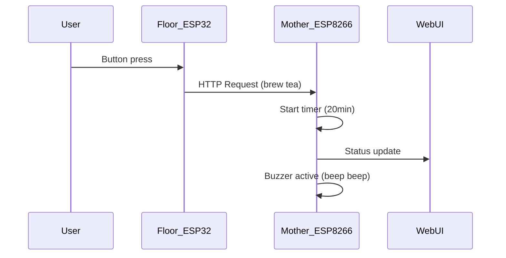
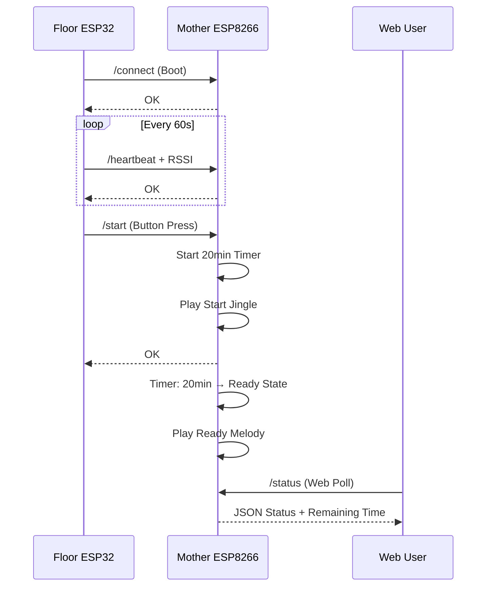

# 🫖 IoT Tea Tracking System

<div align="center">


**Smart IoT system that monitors tea brewing and freshness times**

[](https://github.com/SelcukluOsman/IoT-Tea-Tracking-System)
[](https://github.com/SelcukluOsman/IoT-Tea-Tracking-System)
[](https://github.com/SelcukluOsman/IoT-Tea-Tracking-System)

</div>

## 📱 Live Demo Screenshots

### 📱 Mobile Interface
<div align="center">
<table>
<tr>
<td align="center">

<br/><b>Standby State</b>
</td>
<td align="center">

<br/><b>Brewing Process</b>
</td>
<td align="center">

<br/><b>Freshness Tracking</b>
</td>
</tr>
</table>
</div>

### 💻 Web Dashboard
<div align="center">
<table>
<tr>
<td align="center">

<br/><b>Standby State</b>
</td>
<td align="center">

<br/><b>Brewing Process</b>
</td>
<td align="center">

<br/><b>Freshness Tracking</b>
</td>
</tr>
</table>
</div>

---

## 🏗️ System Architecture

This project is a distributed IoT system consisting of **1 Mother (ESP8266)** and **multiple Floor (ESP32-PICO-D4)** modules.

### 🧠 Mother Module (ESP8266)
- **Static IP Server**: Web dashboard service on `http://10.0.0.77`
- **Heartbeat Interval**: 180 seconds (Floor → Mother)
- **Smart Timer Management**: 20min brewing → 120min freshness automatic transition
- **Advanced Buzzer System**: Start and ready melodies (GPIO13)
- **Live Status LED**: GPIO4 LED blinking for server status
- **Overshoot Protection**: Prevents time loss in delayed queries
- **Connection Quality**: RSSI-based signal quality calculation

### 📍 Floor Modules (ESP32-PICO-D4)
- **Ultra Low Power Design**: 2-4 weeks usage with 400mAh battery
- **Deep Sleep Optimization**: 55 seconds sleep, 5 seconds active cycle
- **Smart Button Detection**: Sensitive button detection with GPIO25
- **NeoPixel Feedback**: Colorful status notification with single LED
- **Minimal Network Usage**: Only button press and heartbeat transmission
- **Battery Management**: Ultra low power consumption (80MHz CPU)
- **Quick Response**: Fast connection with 2-second WiFi timeout

---

## ⚡ Key Features

### ⏱️ Timing System
- **Brewing Time**: 20-minute precise countdown
- **Freshness Time**: 120-minute fresh keeping tracking
- **Visual Progress**: Real-time progress bars
- **Multi-Status**: Separate status management for each floor

### 🔊 Advanced Buzzer System
- **Start Jingle**: C → E → G (523→659→784 Hz) ascending happy melody
- **Ready Melody**: G → E → C → C8 (784→659→523→1046 Hz) celebration jingle
- **Smart Timing**: Clear music effect with silence between tones
- **Non-blocking**: System continues other functions while buzzer is playing

### 📡 Network API Endpoints
- **`/start`** or **`/request`**: Start tea brewing
- **`/heartbeat`**: Life signal from floor modules
- **`/connect`**: New floor module connection
- **`/status`**: JSON format status of all floors
- **`/info`**: System information and statistics

### 🌐 Web Interface
- **Responsive Design**: Mobile and desktop compatible
- **Modern UI/UX**: Gradient colors and smooth animations
- **Multi-Floor Support**: Simultaneous tracking up to 3 floors
- **Status Indicators**: Color-coded status indicators

---

## 🚀 Working Principle

### 1. **Startup Process**


### 2. **Network Communication and Heartbeat System**


**Heartbeat Monitoring:**
- **60-second interval**: Heartbeat signal from Floor modules
- **180-second timeout**: Floor module offline detection
- **Connection Quality**: RSSI-based signal quality (-90 to -30 dBm)
- **Overshoot Protection**: Prevents time loss in delayed timer updates

---

## 🎯 Usage Scenarios

### 🏢 Office Environment
- Multi-floor tea brewing tracking
- Common tea time coordination for team members
- Prevention of tea waste

### 🏠 Home Use
- Personal tea tracking for family members
- Tea preparation for guest hosting situations
- Maintaining tea quality

### 🏭 Industrial Use
- Collective tea service during factory shift breaks
- Floor-based tea management in large office buildings
- Energy saving and efficiency improvement

---

## 🔧 Technical Details

### Hardware Requirements
- **1x ESP8266** (for Mother module)
- **Nx ESP32-PICO-D4** (for Floor modules)
- **Buttons** (GPIO25 - Start button for each floor)
- **NeoPixel LED** (GPIO4 - For visual feedback)
- **Buzzer** (Sound output on Mother module)
- **400mAh Battery** (Portable power for Floor modules)
- **Power Supply** (Fixed power source for Mother module)

### Software Stack
- **Arduino IDE** development
- **ESP8266WiFi** library (Mother)
- **ESP8266WebServer** library (HTTP server)
- **ESP8266mDNS** library (domain resolution)
- **WiFi.h** library (Floor ESP32)
- **HTTPClient** library (HTTP communication)
- **Adafruit_NeoPixel** (LED control)
- **esp_sleep.h** (Ultra low power deep sleep)
- **tone()** function (Buzzer melodies)
- **Custom Timer & State Machine** implementation

### Network Configuration
- **WiFi Connection**: All modules on same network
- **Static IP**: Fixed IP for Mother module (e.g., 10.0.0.77)
- **Port Management**: Special port for HTTP traffic
- **Local Access**: No external internet required

---

## ⚙️ Installation and Configuration

### 1. Hardware Connections
```
Mother ESP8266:
├── Buzzer → GPIO13 (Start/Ready Jingles)
├── Live LED → GPIO4 (Server Status - LOW=ON)
├── WiFi Antenna
└── Power Input (5V/3.3V)

Floor ESP32-PICO-D4:
├── Start Button → GPIO25 (Pull-down)
├── NeoPixel LED → GPIO4 (Data)
├── NeoPixel Enable → GPIO5 (Power Control)
├── WiFi Antenna
└── 400mAh Battery Input
```

### 2. Software Installation
```bash
# Install required libraries in Arduino IDE
# Upload code from docs/ folder to respective modules
# Configure WiFi credentials and IP settings
```

### 3. Network Settings
```cpp
// For Mother module (M-ESP8266.ino)
const char* SSID = "YOUR_WIFI_SSID";
const char* PASSWORD = "YOUR_WIFI_PASSWORD";

// Static IP Configuration
IPAddress local_IP(10,0,0,77);       // Main server IP
IPAddress gateway (10,0,0,1);        // Router IP
IPAddress subnet  (255,255,255,0);   // Subnet mask
IPAddress dns     (8,8,8,8);         // DNS server

// Timer Settings
const unsigned long PREP_MS = 20UL * 60UL * 1000UL;    // 20 minutes
const unsigned long EXPIRE_MS = 120UL * 60UL * 1000UL; // 120 minutes
const unsigned long HEARTBEAT_TIMEOUT = 100000UL;      // 100 seconds

// For Floor modules (F-ESP32-PICO-D4.ino)
const char* WIFI_SSID = "YOUR_WIFI_SSID";
const char* WIFI_PASS = "YOUR_WIFI_PASSWORD";
const char* MAIN_HOST = "10.0.0.77";
const uint16_t MAIN_PORT = 80;
#define FLOOR_ID 3  // Different ID for each floor

// Ultra Low Power Settings
const unsigned long SLEEP_DURATION_US = 55000000UL; // 55s sleep
const unsigned long HB_INTERVAL_MS = 60000UL;       // 60s heartbeat
```

---

## 🎨 Interface Features

### Color Codes
- **🟠 Orange**: Active brewing process
- **🟢 Green**: Ready state / Optimal consumption time
- **🔵 Blue**: Standby / Freshness tracking
- **⚫ Gray**: Inactive / No connection

### Responsive Design
- **Desktop**: 3-column layout for wide screens
- **Tablet**: 2-column adaptive view
- **Mobile**: Single column vertical scroll
- **Cross-browser**: Modern browser support

---

## 📊 Performance and Efficiency

### System Metrics
- **Response Time**: < 180ms (local network)
- **Heartbeat Interval**: 60 seconds (Floor → Mother)
- **Offline Detection**: 180-second timeout
- **Battery Life**: 2-4 weeks for ESP32 (400mAh battery)
- **Deep Sleep Current**: < 10µA (ultra low power mode)
- **Active Current**: ~80mA (WiFi active, 2 seconds)
- **Concurrent Users**: 10+ simultaneous users
- **System Uptime**: 99.9+ reliability
- **mDNS Support**: `tea-system.local` domain resolution

### 🔋 Ultra Low Power Features
- **Deep Sleep Mode**: 55 seconds sleep, 5 seconds active
- **Battery Life**: 2-4 weeks continuous operation with 400mAh
- **Smart Wake-up**: Wake on button press or timer
- **Power Management**: Bluetooth off, 80MHz CPU frequency
- **Minimal Network**: 8-second WiFi timeout, maximum power saving

### 💡 NeoPixel LED Feedback
- **🟢 Green**: Successful button press and server communication
- **🔴 Red**: Connection error or no server response
- **🔵 Cyan**: Quick button confirmation (pre-network)
- **⚫ Off**: Default state for energy saving

---

## 🔮 Future Developments

### v2.0 Planned Features
- [ ] **Mobile App**: Native iOS/Android application
- [ ] **Cloud Integration**: Remote monitoring support
- [ ] **Temperature Sensing**: Tea temperature tracking
- [ ] **User Profiles**: Personalized tea preferences
- [ ] **Analytics Dashboard**: Usage statistics
- [ ] **Voice Control**: Alexa/Google Assistant integration

### Advanced Features
- **Machine Learning**: Usage pattern analysis
- **Push Notifications**: Mobile notifications
- **Multi-Language**: Multiple language support
- **API Integration**: Third-party service support

---

## 👥 Contributing

This project is developed with an open-source spirit. We welcome your contributions!

### How to Contribute?
1. **Fork** the repository
2. Create a **feature branch** (`git checkout -b feature/AmazingFeature`)
3. **Commit** your changes (`git commit -m 'Add some AmazingFeature'`)
4. **Push** to the branch (`git push origin feature/AmazingFeature`)
5. Open a **Pull Request**

---

## 📄 License

This project is developed by **OSS EMBEDDED SYSTEM**.
© 2025 • All Rights Reserved

---

## 📞 Contact

**Developer**: Osman Selçuklu 
**Linkedin**: [@SelcukSELCUKLU](https://www.linkedin.com/in/selcukselcuklu/)  

---

<div align="center">

**☕ You've never tracked your tea this smartly! ☕**

[⭐ Give a Star](https://github.com/SelcukluOsman/IoT-Tea-Tracking-System) | [🍴 Fork it](https://github.com/SelcukluOsman/IoT-Tea-Tracking-System/fork) | [📝 Open an Issue](https://github.com/SelcukluOsman/IoT-Tea-Tracking-System/issues)

</div>
